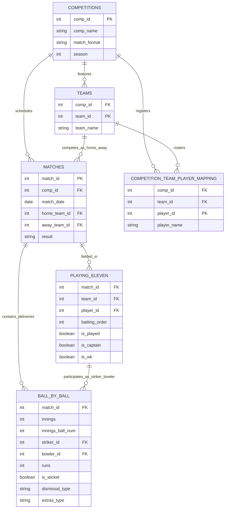

# PressureIQ — Dataset Entity-Relationship Architecture

```mermaid
erDiagram
    COMPETITIONS ||--o{ TEAMS : "features"
    COMPETITIONS ||--o{ MATCHES : "schedules"
    COMPETITIONS ||--o{ COMPETITION_TEAM_PLAYER_MAPPING : "registers"
    TEAMS ||--o{ COMPETITION_TEAM_PLAYER_MAPPING : "rosters"
    TEAMS ||--o{ MATCHES : "competes_as_home_away"
    MATCHES ||--o{ PLAYING_ELEVEN : "fielded_in"
    MATCHES ||--o{ BALL_BY_BALL : "contains_deliveries"
    PLAYING_ELEVEN ||--o{ BALL_BY_BALL : "participates_as_striker_bowler"

    COMPETITIONS {
        int comp_id PK
        string comp_name
        string match_format
        int season
    }

    TEAMS {
        int comp_id FK
        int team_id PK
        string team_name
    }

    COMPETITION_TEAM_PLAYER_MAPPING {
        int comp_id FK
        int team_id FK
        int player_id PK
        string player_name
    }

    MATCHES {
        int match_id PK
        int comp_id FK
        date match_date
        int home_team_id FK
        int away_team_id FK
        string result
    }

    PLAYING_ELEVEN {
        int match_id FK
        int team_id FK
        int player_id FK
        int batting_order
        boolean is_played
        boolean is_captain
        boolean is_wk
    }

    BALL_BY_BALL {
        int match_id FK
        int innings
        int innings_ball_num
        int striker_id FK
        int bowler_id FK
        int runs
        boolean is_wicket
        string dismissal_type
        string extras_type
    }
```
